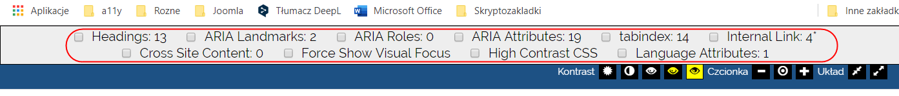

# WET       
Web Evaluation Tools bookmarklet to zestaw 10 narzędzi pomagających zbadać i ocenić dostępność strony internetowej. Narzędzie przeznaczone jest dla osób, które dysponują podstawową wiedzą o dostępności.

## Dane źródłowe
- **Autor:** IT Accessibility z [NC State University](https://accessibility.oit.ncsu.edu/)
- **Pobierz skryptozakładkę**: [Web Evaluation Tools Bookmarklet](https://accessibility.oit.ncsu.edu/tools/web-evaluation-tools/)
WET - zestaw.

## Stosowanie
Za pomocą narzędzi na badanej stronie możemy zobaczyć właściwości niewidoczne bez dokładniejszej analizy albo wręcz niewidoczne.

- **Headings** - wyróżnia nagłówki, w tym ukryte,
- **ARIA Landmarks** - wyróżnia punkty orientacyjne wraz z etykietami, jeśli istnieją (nie wyróżnia obszarów oznaczonych atrybutem role="region"),
- **Aria Roles** - wyróżnia obiekty z jawnie określonymi atrybutami role, innymi niż punkty orientacyjne, a także obszary z atrybutem role="region",
- **ARIA Attributies** - wyróżnia obiekty z oznaczonymi atrybutami ARIA i wartości tych atrybutów,
- **Tabindex** - wyróżnia obiekty z oznaczonym atrybutem tabindex, podaje wartość atrybutu,
- **Internal Link** - wyróżnia łącza wewnętrzne, prowadzące do miejsc na stronie, zarówno ich źródło, jak i cel. Jeśli określono dla łącza atrybut tabindex, podaje jego wartość, jeśli nie określono, komunikuje brak atrybutu (missing tabindex
- **Cross Site Content** - wyróżnia obszary zawartości pochodzące z innych witryn (np. reklamy),
- **Force Show Visual Focus** - wymusza widoczność fokusa (punktów uwagi),
- **High Contrast CSS** - przełącza widok w tryb wysokiego kontrastu,
- **Language Attributes** - wyróżnia części strony z oznaczonym atrybutem języka i wartość atrybutu.
Aby uaktywnić skryptozakładkę na przeglądanej stronie, klikamy w menu zakładek jej łącze, co spowoduje, że przy górnej krawędzi okna przeglądarki zostanie wyświetlony pasek narzędziowy z 10 polami wyboru i etykietami. Obok etykiety wyświetlana jest liczba wystąpień danego obiektu na stronie. Zaznaczenie pola spowoduje wyróżnienie zaznaczonych elementów. Odznaczenie pola wyboru spowoduje usunięcie wskazówek wizualnych ze strony. Równocześnie można zaznaczyć wiele elementów.